<p align="center">
    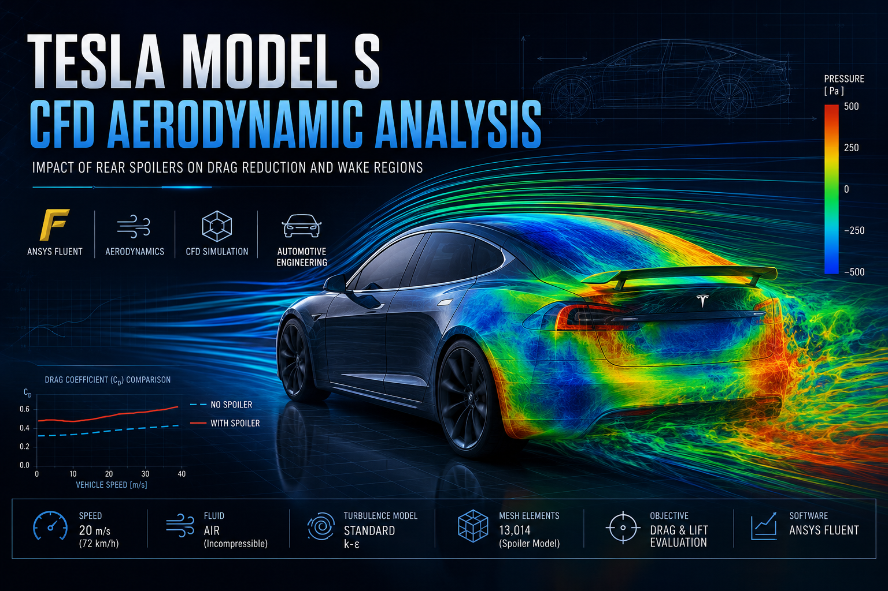
</p>

<h1 align="center">🚗 Tesla Model S Spoiler CFD Analysis</h1>

<p align="center">
A Computational Fluid Dynamics (CFD) study investigating the aerodynamic impact of a rear spoiler on the Tesla Model S by comparing drag, lift, pressure distribution, velocity fields, and wake characteristics using ANSYS Fluent.
</p>

<p align="center">


</p>

<p align="center">


</p>

---

## 📑 Table of Contents

- [Project Overview](#-project-overview)
- [Project Objectives](#-project-objectives)
- [Project Specifications](#-project-specifications)
- [Aerodynamics Background](#️-aerodynamics-background)
- [Vehicle Models](#-vehicle-models)
- [CAD Preparation](#️-cad-preparation)
- [Mesh Generation](#️-mesh-generation)
- [CFD Simulation Setup](#️-cfd-simulation-setup)
- [Simulation Results](#-simulation-results)
  - [Pressure Distribution](#-pressure-distribution)
  - [Velocity Distribution](#-velocity-distribution)
  - [Velocity Vectors](#-velocity-vectors)
  - [Aerodynamic Coefficients](#-aerodynamic-coefficients)
- [Aerodynamic Comparison](#-aerodynamic-comparison)
- [Engineering Discussion](#-engineering-discussion)
- [Conclusions](#-conclusions)
- [Future Improvements](#-future-improvements)
- [Repository Structure](#-repository-structure)
- [Documentation](#-documentation)
- [Software & Tools](#️-software--tools)
- [References](#-references)
- [License](#-license)

---

## 📖 Project Overview

Aerodynamic performance is one of the most important factors influencing the efficiency, stability, and energy consumption of modern electric vehicles. While reducing aerodynamic drag improves driving range, maintaining adequate downforce is equally important for high-speed stability and vehicle handling.

Rear spoilers are commonly used to modify the airflow over a vehicle, reducing wake size and improving the pressure distribution behind the car. However, the aerodynamic benefits of a spoiler depend heavily on its geometry, placement, and operating conditions.

This project investigates the influence of a rear spoiler on the aerodynamic performance of the **Tesla Model S** using **Computational Fluid Dynamics (CFD)**. Two vehicle configurations were analyzed:

- Tesla Model S without a rear spoiler
- Tesla Model S with a rear spoiler

Both models were simulated under identical boundary conditions in **ANSYS Fluent**, allowing a direct comparison of their aerodynamic characteristics across:

- Drag coefficient (Cd)
- Lift coefficient (Cl)
- Pressure distribution
- Velocity distribution
- Wake formation
- Flow separation

The findings provide insight into how a rear spoiler influences the airflow around the vehicle and its overall aerodynamic efficiency.

---

## 🎯 Project Objectives

The primary objective of this study was to evaluate the aerodynamic effects of adding a rear spoiler to the Tesla Model S through numerical simulation. Specific objectives include:

- Develop CAD models for both vehicle configurations.
- Generate computational meshes suitable for external aerodynamic analysis.
- Configure CFD simulations in ANSYS Fluent.
- Compare drag and lift characteristics.
- Investigate pressure and velocity distributions.
- Analyze wake development behind the vehicle.
- Evaluate the overall effectiveness of the rear spoiler.

---

## 📋 Project Specifications

| Category | Details |
|---|---|
| **Software** | ANSYS Fluent, ANSYS Meshing, SolidWorks |
| **Analysis Type** | External Aerodynamics, Steady-State CFD |
| **Vehicle** | Tesla Model S |
| **Configurations** | Without Rear Spoiler / With Rear Spoiler |
| **Outputs** | Pressure contours, velocity contours, velocity vectors, drag coefficient (Cd), lift coefficient (Cl), residual convergence |
| **Engineering Fields** | Computational Fluid Dynamics, Automotive Aerodynamics, Vehicle Design, Flow Analysis |

---

## 🌬️ Aerodynamics Background

When a vehicle moves through air, it experiences aerodynamic forces generated by the interaction between the body geometry and the surrounding airflow. The two primary forces considered in this study are:

**Drag** — the aerodynamic force acting opposite to the vehicle's direction of motion. Excessive drag increases energy consumption and reduces the driving range of electric vehicles.

**Lift** — the aerodynamic force acting perpendicular to the direction of travel. For passenger vehicles, excessive positive lift reduces tire grip and compromises high-speed stability.

Rear spoilers are designed to modify the airflow near the rear of the vehicle, reducing flow separation and altering the wake region. Proper spoiler design can improve stability while minimizing additional aerodynamic drag.

---

## 🚗 Vehicle Models

Two three-dimensional CAD models were prepared and analyzed throughout this project.

### Model 1 — Without Rear Spoiler

<p align="center">
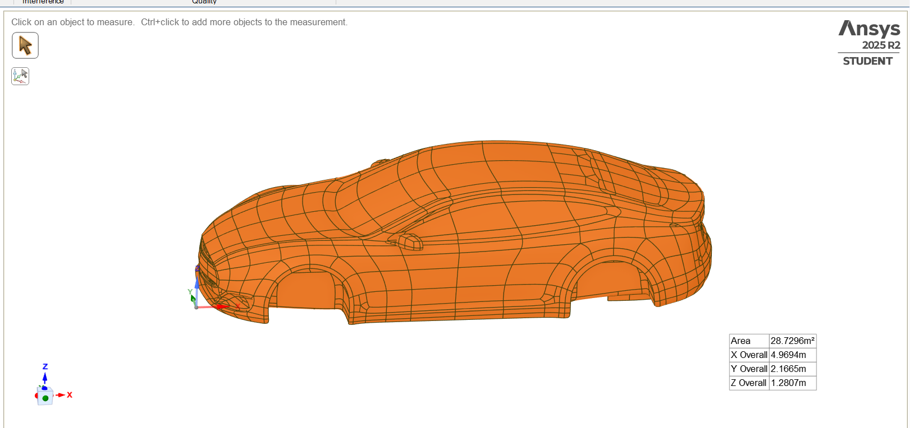
</p>

The baseline Tesla Model S geometry was used to establish the reference aerodynamic performance of the vehicle.

### Model 2 — With Rear Spoiler

<p align="center">
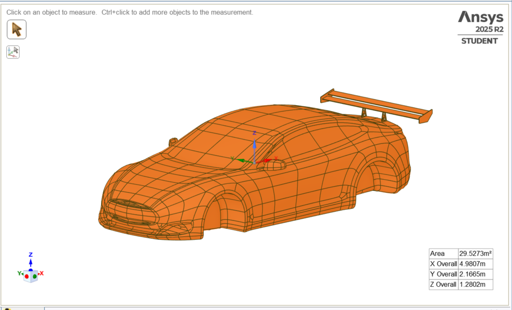
</p>

A rear spoiler was integrated into the original vehicle geometry to investigate its influence on airflow behavior and aerodynamic forces.

Both models were subjected to identical simulation conditions to ensure that any observed differences resulted solely from the addition of the rear spoiler.

---

## 🛠️ CAD Preparation

Before performing the CFD analysis, two separate vehicle geometries were prepared to ensure a controlled comparison of the aerodynamic effects of a rear spoiler.

The first model represents the **baseline Tesla Model S**, while the second incorporates a **rear spoiler** mounted on the trunk lid. Both models share identical overall dimensions, allowing any differences in aerodynamic performance to be attributed solely to the spoiler. The CAD models were prepared using **SolidWorks** and exported in a format compatible with the ANSYS simulation workflow.

### Baseline Model

<p align="center">

</p>

> **Figure 1.** Tesla Model S without a rear spoiler.

### Modified Model

<p align="center">

</p>

> **Figure 2.** Tesla Model S equipped with a rear spoiler.

### Design Considerations

The spoiler geometry was selected to investigate how a rear aerodynamic device influences:

- Wake development
- Pressure distribution
- Velocity distribution
- Drag coefficient
- Lift coefficient
- Overall vehicle stability

Both CAD models were carefully inspected before meshing to ensure watertight geometry and eliminate features that could negatively affect mesh quality.

---

## 🕸️ Mesh Generation

A high-quality computational mesh is essential for obtaining reliable CFD results. The computational domain was discretized using ANSYS Meshing, producing independent meshes for both vehicle configurations. The mesh was refined around regions where significant flow gradients were expected, particularly near the vehicle body and rear wake.

### Vehicle Without Spoiler

<p align="center">
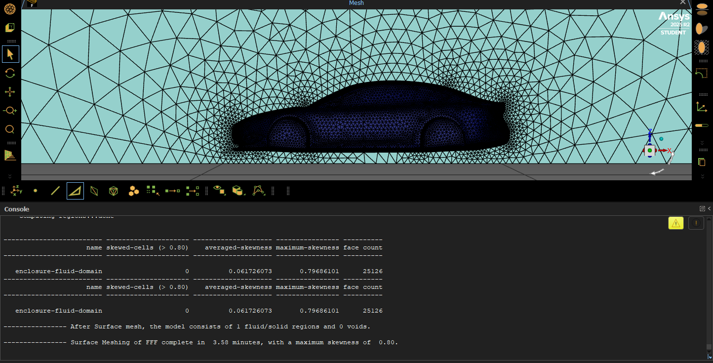
</p>

> **Figure 3.** Computational mesh for the baseline vehicle.

### Vehicle With Spoiler

<p align="center">
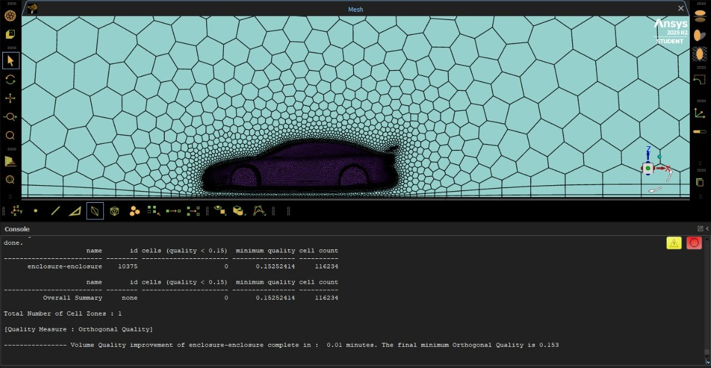
</p>

> **Figure 4.** Computational mesh for the spoiler configuration.

### Meshing Strategy

The computational mesh was designed to:

- Capture the vehicle geometry accurately.
- Resolve flow behavior near the vehicle surface.
- Improve wake prediction behind the vehicle.
- Maintain acceptable computational cost.
- Produce stable numerical convergence.

Special attention was given to the rear region of the vehicle, where wake formation and vortex structures significantly influence aerodynamic performance.

---

## ⚙️ CFD Simulation Setup

Both vehicle configurations were simulated using **ANSYS Fluent** under identical operating conditions to provide a fair aerodynamic comparison.

### Solver Configuration

| Parameter | Setting |
|---|---|
| Solver Type | Pressure-Based |
| Flow Type | Steady State |
| Fluid | Air |
| Turbulence Model | Standard k-ε |
| Pressure-Velocity Coupling | SIMPLE |
| Spatial Discretization | Second Order |
| Software | ANSYS Fluent |

### Boundary Conditions

The computational domain was configured to represent external airflow around the vehicle. The following boundary conditions were applied:

- Velocity inlet
- Pressure outlet
- Stationary ground
- Vehicle walls with no-slip condition
- Symmetry conditions where applicable

Using identical boundary conditions for both models ensures that any variation in aerodynamic performance results from the addition of the rear spoiler rather than changes in the simulation setup.

### Simulation Workflow

```text
CAD Geometry
      │
      ▼
Geometry Cleanup
      │
      ▼
Mesh Generation
      │
      ▼
Boundary Conditions
      │
      ▼
Solver Configuration
      │
      ▼
Numerical Solution
      │
      ▼
Post Processing
      │
      ▼
Aerodynamic Comparison
```

### Numerical Convergence

To verify solution stability, the residual history of each simulation was monitored throughout the iterative process.

**Without Rear Spoiler**

<p align="center">
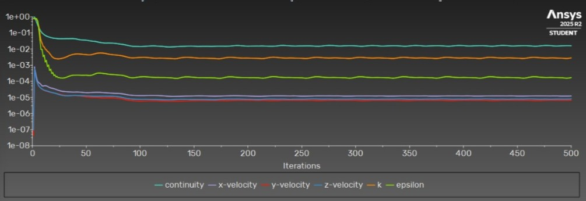
</p>

> **Figure 5.** Residual convergence history for the baseline model.

**With Rear Spoiler**

<p align="center">
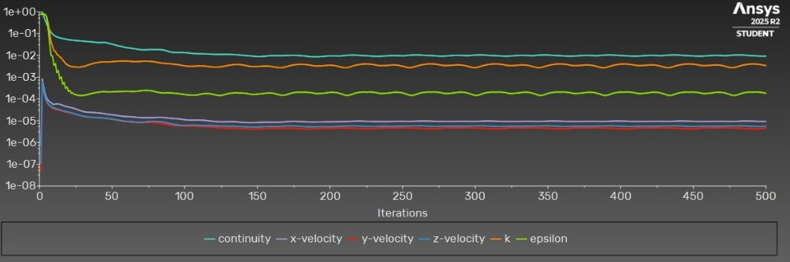
</p>

> **Figure 6.** Residual convergence history for the spoiler model.

The convergence histories indicate that both simulations reached stable numerical solutions before extracting aerodynamic data, providing confidence in the validity of the reported results.

---

## 📊 Simulation Results

After both CFD simulations reached numerical convergence, the aerodynamic characteristics of the two vehicle configurations were evaluated and compared, focusing on:

- Pressure distribution
- Velocity distribution
- Flow behavior around the vehicle
- Wake development
- Drag coefficient (Cd)
- Lift coefficient (Cl)

Together, these results provide a comprehensive understanding of how the rear spoiler influences the airflow around the Tesla Model S.

### 🌈 Pressure Distribution

Pressure contours reveal how airflow interacts with the vehicle body and identify regions of high and low pressure. High-pressure regions generally occur at the front of the vehicle where airflow stagnates, while low-pressure regions appear over the roof and behind the vehicle due to flow acceleration and separation.

**Vehicle Without Rear Spoiler**

<p align="center">
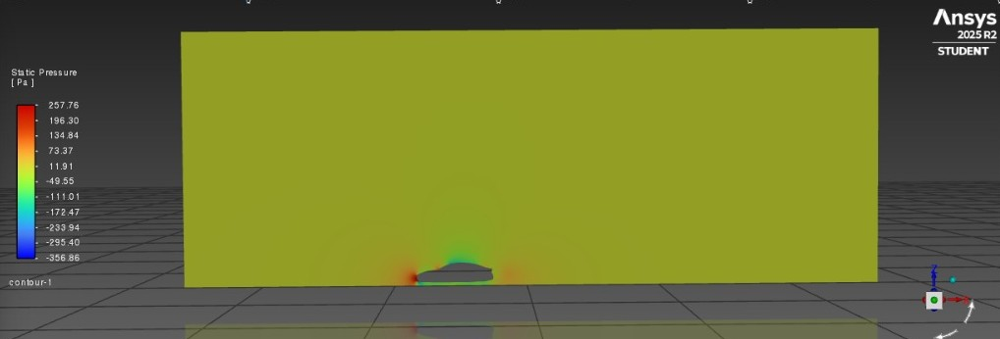
</p>
<p align="center">
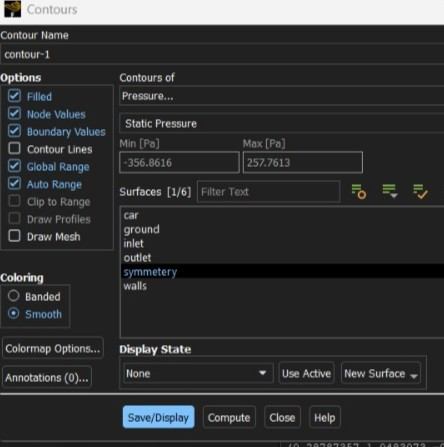
</p>
<p align="center">
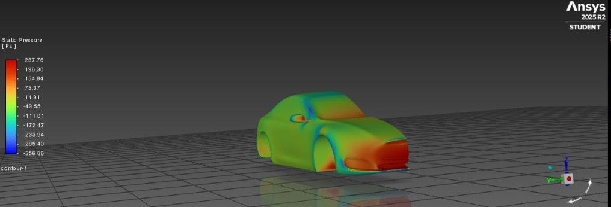
</p>

The baseline vehicle exhibits a large low-pressure wake behind the rear surface, indicating significant flow separation and energy loss.

**Vehicle With Rear Spoiler**

<p align="center">
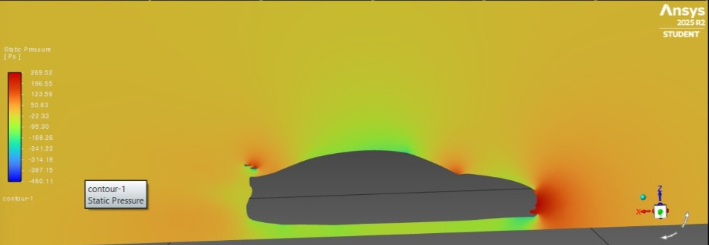
</p>
<p align="center">
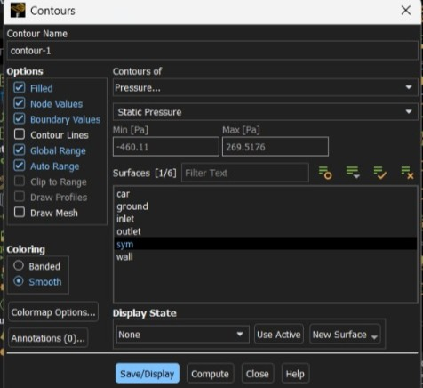
</p>
<p align="center">
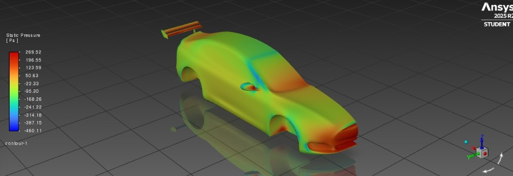
</p>

The addition of the rear spoiler modifies the pressure field near the rear of the vehicle, reducing flow separation and improving pressure recovery in the wake region.

### 💨 Velocity Distribution

Velocity contours illustrate how airflow accelerates and decelerates around the vehicle body. Regions of accelerated flow correspond to lower pressure according to Bernoulli's principle, while slower-moving regions often indicate wake formation and turbulence.

**Vehicle Without Rear Spoiler**

<p align="center">
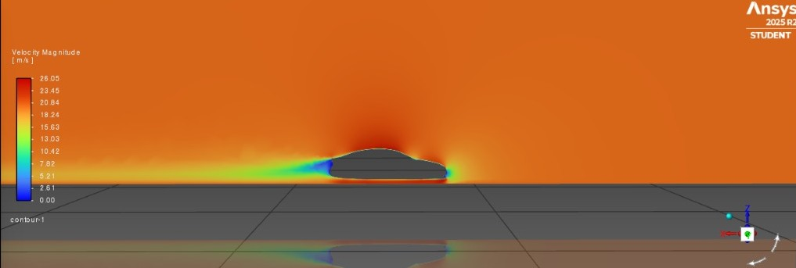
</p>
<p align="center">
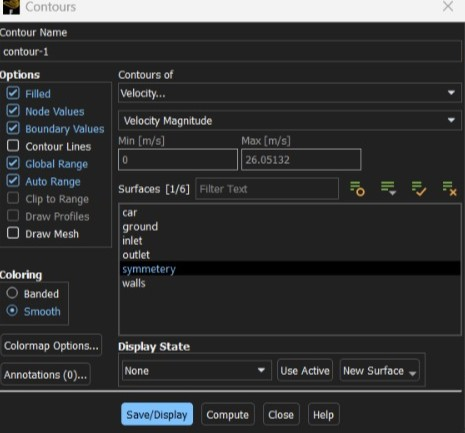
</p>

The baseline configuration produces a relatively large low-velocity wake behind the vehicle, which contributes to pressure drag.

**Vehicle With Rear Spoiler**

<p align="center">
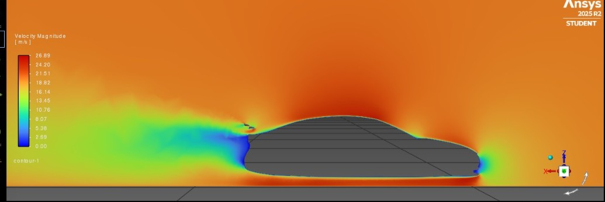
</p>
<p align="center">
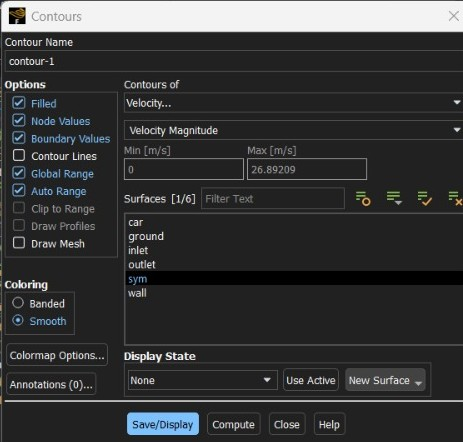
</p>

The spoiler helps guide airflow leaving the rear surface, reducing wake size and improving flow organization.

### 🌀 Velocity Vectors

Velocity vectors provide a clearer visualization of airflow direction and vortex formation around the vehicle.

**Without Rear Spoiler**

<p align="center">
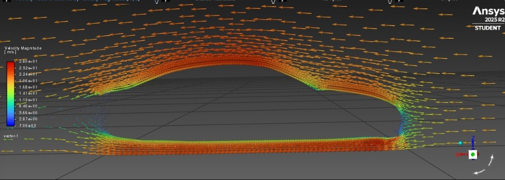
</p>

**With Rear Spoiler**

<p align="center">
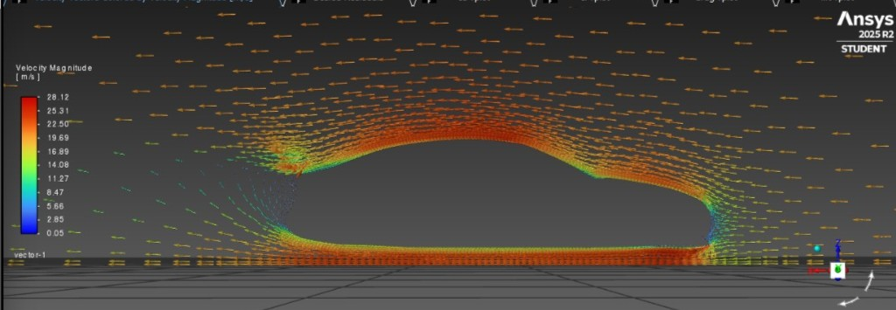
</p>

Compared to the baseline model, the spoiler configuration exhibits a more controlled wake region with reduced recirculation behind the vehicle.

### 📈 Aerodynamic Coefficients

The drag coefficient (Cd) and lift coefficient (Cl) were monitored throughout the simulations to evaluate aerodynamic performance and numerical stability.

**Drag Coefficient (Cd)**

<p align="center">
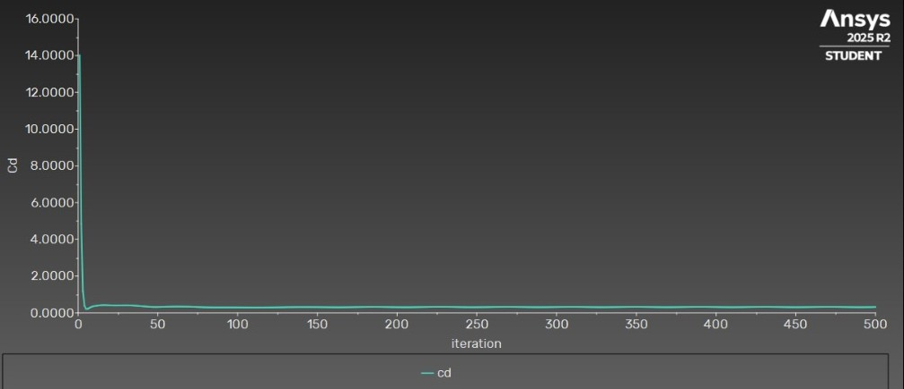
</p>
<p align="center">
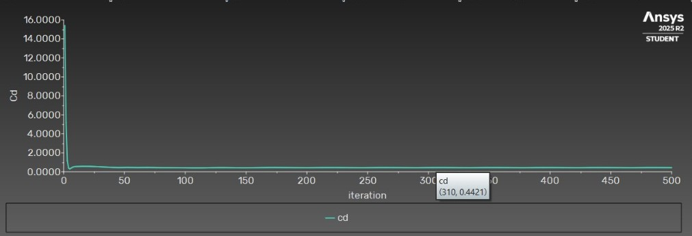
</p>

The drag coefficient converged to stable values for both vehicle configurations, enabling a reliable comparison of aerodynamic efficiency.

**Lift Coefficient (Cl)**

<p align="center">
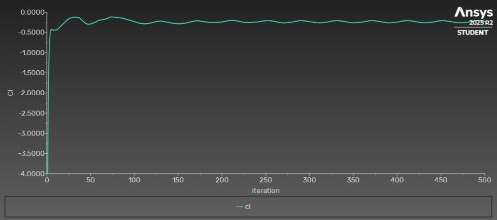
</p>
<p align="center">
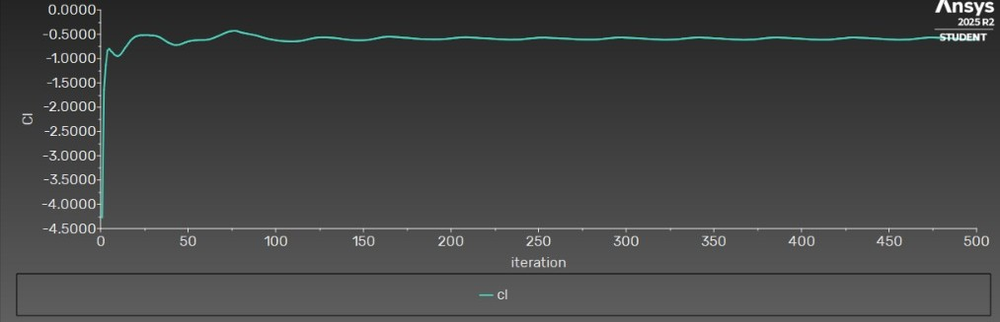
</p>

The rear spoiler influences the lift characteristics by modifying the pressure distribution over the rear portion of the vehicle, improving high-speed stability.

---

## 📊 Aerodynamic Comparison

<p align="center">
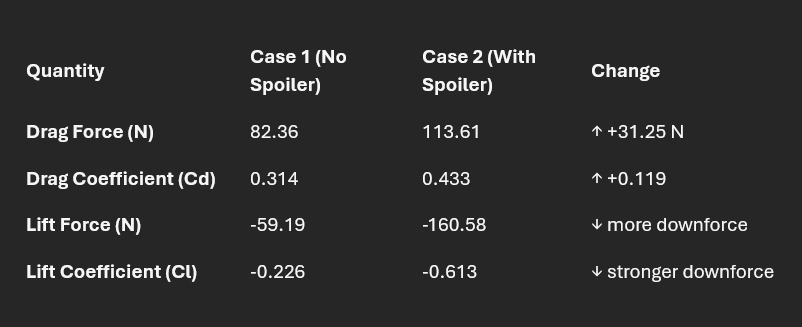
</p>

The comparison demonstrates the aerodynamic influence of the rear spoiler under identical simulation conditions.

**Key Observations**

- Reduced flow separation behind the vehicle.
- Improved pressure recovery in the wake region.
- More organized airflow leaving the rear surface.
- Enhanced vehicle stability through reduced rear lift.
- Small changes in drag accompanied by improved aerodynamic balance.

---

## 💬 Engineering Discussion

The CFD analysis demonstrates that relatively small geometric modifications can produce measurable changes in vehicle aerodynamics. Although rear spoilers are often associated with high-performance vehicles, they also contribute to improved flow management by altering wake behavior and reducing undesirable aerodynamic effects.

The results obtained in this study indicate that the spoiler primarily enhances stability by influencing the rear pressure distribution and reducing lift, while maintaining competitive aerodynamic efficiency.

From an engineering perspective, this project illustrates how Computational Fluid Dynamics can be used during the design process to evaluate aerodynamic performance before physical prototyping, reducing development cost and accelerating design optimization.

---

## ✅ Conclusions

This project investigated the aerodynamic influence of a rear spoiler on the Tesla Model S using Computational Fluid Dynamics (CFD) simulations performed in ANSYS Fluent. Two vehicle configurations — one with a rear spoiler and one without — were analyzed under identical operating conditions to ensure a fair comparison of their aerodynamic characteristics.

The simulations demonstrated that the addition of the rear spoiler modifies the airflow around the rear of the vehicle, influencing the pressure distribution, wake development, and aerodynamic forces.

**Key outcomes of the study include:**

- Successful development of two CFD-ready vehicle models.
- Generation of high-quality computational meshes.
- Stable numerical convergence for both simulations.
- Comprehensive comparison of pressure and velocity fields.
- Evaluation of drag and lift coefficients.
- Assessment of the aerodynamic influence of a rear spoiler.

Overall, the study highlights the value of Computational Fluid Dynamics as a powerful engineering tool for evaluating and optimizing vehicle aerodynamics before physical prototyping.

---

## 🚀 Future Improvements

### Simulation Improvements
- Perform transient CFD simulations.
- Conduct mesh independence studies.
- Investigate multiple turbulence models.
- Include rotating wheel effects.
- Model a moving ground boundary.
- Analyze additional vehicle speeds.

### Design Improvements
- Different spoiler heights.
- Adjustable spoiler angles.
- Alternative spoiler profiles.
- Active aerodynamic systems.
- Front splitters and rear diffusers.
- Combined aerodynamic packages.

### Advanced Analysis
- Crosswind stability analysis.
- Side-force evaluation.
- Yaw angle simulations.
- Rain and water flow analysis.
- Thermal management of EV battery cooling.
- Underbody aerodynamic optimization.

---

## 📁 Repository Structure

```text
tesla-model-s-spoiler-cfd-analysis
│
├── cad
│   ├── mesh
│   ├── sp_S.STEP
│   ├── sp.SLDPRT
│   └── Tesla_base.stp
│
├── case-and-data
│   ├── spoiler.cas.h5
│   ├── spoiler.dat.h5
│   ├── no-spoiler.cas.h5
│   └── no-spoiler.dat.h5
│
├── docs
│   └── Impact_of_Rear_Spoilers_CFD_Report.pdf
│
├── images
│   ├── banner-cfd.png
│   ├── car-with-spoiler-assembly.png
│   ├── car-with-spoiler-mesh.jpeg
│   ├── car-with-spoiler-pressure-contour.jpeg
│   ├── car-with-spoiler-pressure-contour-values.jpeg
│   ├── car-with-spoiler-pressure-contour-3d.jpeg
│   ├── car-with-spoiler-velocity-contour.jpeg
│   ├── car-with-spoiler-velocity-contour-values.jpeg
│   ├── car-with-spoiler-velocity-vector.jpeg
│   ├── car-with-spoiler-cd-graph.jpeg
│   ├── car-with-spoiler-cl-graph.jpeg
│   ├── car-without-spoiler.png
│   ├── car-without-spoiler-mesh.png
│   ├── car-without-spoiler-pressure-contour.jpeg
│   ├── car-without-spoiler-pressure-contour-values.jpeg
│   ├── car-without-spoiler-pressure-contour-3d.jpeg
│   ├── car-without-spoiler-velocity-contour.jpeg
│   ├── car-without-spoiler-velocity-contour-values.jpeg
│   ├── car-without-spoiler-velocity-vector.jpeg
│   ├── car-without-spoiler-cd-graph.jpeg
│   ├── car-without-spoiler-cl-graph.jpeg
│   └── comparsion-table.jpeg
│
├── simulation
│
├── README.md
├── LICENSE
└── .gitignore
```

---

## 📄 Documentation

A detailed engineering report is included in the repository, documenting the complete workflow from CAD preparation through CFD simulation and aerodynamic analysis.

```text
docs/Impact_of_Rear_Spoilers_CFD_Report.pdf
```

The report includes:

- Introduction
- Literature Review
- CAD Preparation
- Mesh Generation
- CFD Methodology
- Boundary Conditions
- Solver Configuration
- Pressure Analysis
- Velocity Analysis
- Drag and Lift Evaluation
- Conclusions
- References

---

## 🛠️ Software & Tools

| Category | Software |
|----------|----------|
| CAD Modeling | SolidWorks |
| CFD Pre-processing | ANSYS SpaceClaim |
| Meshing | ANSYS Meshing |
| CFD Solver | ANSYS Fluent |
| Documentation | Microsoft Word |

---

## 📚 References

- ANSYS Fluent Documentation
- ANSYS Meshing Documentation
- SolidWorks Documentation
- Fundamentals of Vehicle Aerodynamics
- Computational Fluid Dynamics course materials
- Automotive engineering literature

---

## 📄 License

This project is licensed under the **MIT License**. See the [LICENSE](LICENSE) file for additional details.

---

## ⭐ If You Found This Project Interesting

- ⭐ Star the repository
- 🍴 Fork the project
- 📢 Share your feedback
- 🤝 Connect with me on LinkedIn

---

<p align="center">

### 🚗 Designed & Developed by Mohamed Samer

**Mechatronics Engineering Student**

*Automotive Engineering • Computational Fluid Dynamics • CAD Design • Aerodynamics*

</p>
